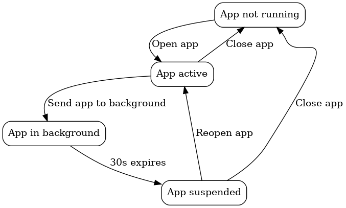
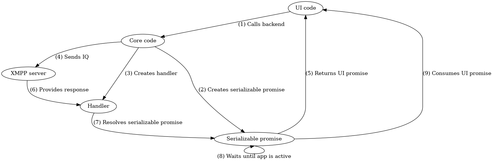

In this new series, I want to shine some light onto specific parts of Monal's internals. It's dedicated to programmers or people curious about how Monal works internally.
If you want to give some feedback, feel free to send an email to [thilo@monal-im.org](mailto:thilo@monal-im.org)

**Other articles in this series:**
- [Monal Internals - Handlers framework](00007-monal-internals-handlers)
- [Monal Internals - XML Query Language](00014-monal-internals-xml-query-language)


# Serializable Promise Framework
XMPP as a protocol is, as most protocols are, inherently asynchronous.
In Monal we therefore use the popular [PromiseKit](https://github.com/mxcl/PromiseKit) library
to let the UI know when a XMPP action finished or failed.

But this has a huge drawback: PromiseKit-based promises aren't serializable, so we can't respond to events
that got handled by the Notification Service App Extension while the app was suspended.
The serializable promise framework is a new framework in Monal, which exactly fills that gap.

## Overall Process
For instance, imagine you want to remove the avatar of a group chat in Monal, while on a slow, unreliable network.

1. You submit the request, and the loading screen appears over the view (0:03)
1. Because the network is slow, the loading screen persists for a long time
1. You get frustrated and switch apps, sending Monal to the background (0:06)
1. After 30s in the background, Monal gets suspended (0:36)
1. The server fails to remove the avatar and sends an error to Monal
1. The response is handled by Monal’s app extension in the background (0:51)
1. You switch apps back to Monal (0:57)
Without the promise framework, the app would have continued to show the loading screen indefinitely, requiring you to fully close and open the app.

However, with the promise framework, when you switch back to the app, the loading screen disappears and correctly shows the error returned by the server:



The promise framework allows any such interaction, where the UI has to update in response from the server, to be handled in a general way.

## Background
We will briefly describe the important parts below. But these links provide more detailed context and are recommended reading:
* The [app decomposition slides](https://xmpp-meetup.in-berlin.de/talks/monal-and-push.pdf#Navigation6) explain the split between the main app and app extension.
* The [handler framework blog post](https://monal-im.github.io/monal-im.org/site/post/00007-monal-internals-handlers/#handlers) explores some of the consequences of this split.

### Main app and app extension
In Monal there are two separate processes: the “main app” (`MonalAppDelegate`) and “app extension” (`NotificationService`), which is sometimes abbreviated to “appex”.

Since they do not share memory, they hand over to each other via the [handler framework](https://monal-im.github.io/monal-im.org/site/post/00007-monal-internals-handlers/#handlers).

An xmpp stanza can be processed by either, depending on whether the app is running or not:


### App states
Below is a slightly simplified diagram of the app’s lifecycle. A more detailed lifecycle from Apple’s perspective is [available here](https://developer.apple.com/documentation/uikit/managing-your-app-s-life-cycle).



| State             | Description                                                             |
| ----------------- | ----------------------------------------------------------------------- |
| App not running   | App is not running, and when it is opened, it will start afresh         |
| App active        | App is open and in the foreground                                       |
| App in background | App is running, but in the background                                   |
| App suspended     | App is not running, but its state is saved for when the app is reopened |

* The app moves from "active" to "in background" when it is swiped away without being closed
  * It continues to run and process stanzas for ~30s in the background
* Once the 30s are complete, it moves to "suspended"
  * Apple saves the UI's state
  * When the app is reopened, it returns to the same screen as before
  * Any stanzas that were processed in the meantime were processed by the appex

#### Appex states
Meanwhile, the appex has a more simple lifecycle - it is either running, or not running:


* Once the appex starts, it will connect to the server and run for 30s
* If the app is opened while the appex is running, the appex will return to "not running" state in deference to the app.

## Serializable promise framework
Ok, now the background is out of the way, time to explain the promise framework!

While promises are very useful in SwiftUI, there is one problem: they only exist in that particular process, and cannot easily be passed between the app and appex.

This means that, if the promise was resolved in the appex, once the app is reopened (moves from suspended to active), it will not be consumed. This is because the appex has no way of tying the result back to the promise that updates the UI.

Since the handler framework is what allows the seamless handoff between the app and appex, we need a way to trigger consumption of a promise as a result of processing in the handler. This is precisely what the promise framework does!

### High-level overview
We create a "serializable promise" class called `MLPromise`. This class stores a "UI promise" which is an `AnyPromise` from PromiseKit. Consumption of this `AnyPromise` is what ultimately causes the UI to update.

Whenever we want to bind a UI action to the result of a handler, we create an `MLPromise` and pass it as an argument to the handler. We then return the `MLPromise`'s `AnyPromise` to the UI.

Unlike the `AnyPromise` it contains, the `MLPromise` is (mostly) serializable. When the `MLPromise` is created, and whenever it is resolved, it [persists itself](https://github.com/monal-im/Monal/blob/c20c9f9968109f0652bf640804b852f143bd5000/Monal/Classes/DataLayer.m#L2542-L2553) to a [new `promises` table](https://github.com/monal-im/Monal/blob/c20c9f9968109f0652bf640804b852f143bd5000/Monal/Classes/DataLayerMigrations.m#L1153-L1156) in the database.

Meanwhile, whenever the app or appex is unfrozen, and [the promise table is read into memory](https://github.com/monal-im/Monal/blob/c20c9f9968109f0652bf640804b852f143bd5000/Monal/Classes/MLPromise.m#L49-L56), the resolved arguments of any already existing promises are overwritten.

Note that [this persisted version of the `MLPromise` is not complete](https://github.com/monal-im/Monal/blob/c20c9f9968109f0652bf640804b852f143bd5000/Monal/Classes/MLPromise.m#L168-L173) - while the resolved argument can be persisted, the UI promise is not persisted at any stage.

This means that, while the resolved argument can be passed betwen the app and appex, the UI promise itself cannot. The consequence of this is that a promise cannot be consumed in the appex - it can only be resolved there, leaving consumption for when the app becomes active again:

| Process | Can resolve? | Can consume? |
| ------- | ------------ | ------------ |
| App     | Yes          | Yes          |
| Appex   | Yes          | No           |

This makes some sense, as the whole purpose of the `AnyPromise` is to update the UI as a result of some backend action. It only makes sense to update the UI from the process which manages the UI - the app itself.

As a result, whenever the app becomes active again, all outstanding `MLPromise`s check the version retrieved from the DB if they have been resolved in the meantime, [and if so, consume themselves](https://github.com/monal-im/Monal/blob/c20c9f9968109f0652bf640804b852f143bd5000/Monal/Classes/MLPromise.m#L77). This is how the loading overlay gets removed in the above example.

### Step-by-step overview
Let's return to the initial scenario of removing the avatar of a group chat. The user chooses the new avatar and presses submit. Then, the following happens:



#### [(1) UI code calls backend](https://github.com/monal-im/Monal/blob/c20c9f9968109f0652bf640804b852f143bd5000/Monal/Classes/ContactDetails.swift#L146-L148)

The UI code responding to requests to remove the avatar calls the backend method to do this.

Once the backend function completes, it will return an `AnyPromise`, allowing the UI code to continue immediately:

```swift
showPromisingLoadingOverlay(overlay, headlineView:Text("Removing avatar..."), descriptionView:Text("")) {
    // this returns an AnyPromise used by the loading overly to hide itself once it gets resolved
    self.account.mucProcessor.publishAvatar(nil, forMuc: contact.contactJid)
}
```

#### [(2) Core code creates promise](https://github.com/monal-im/Monal/blob/c20c9f9968109f0652bf640804b852f143bd5000/Monal/Classes/MLMucProcessor.m#L1292)

The core code creates an `MLPromise`:

```objc
-(AnyPromise*) publishAvatar:(UIImage* _Nullable) image forMuc:(NSString*) room
{
    MLPromise* promise = [MLPromise new];
    // ...
```

#### [(3) Core code creates handler and (4) sends IQ](https://github.com/monal-im/Monal/blob/c20c9f9968109f0652bf640804b852f143bd5000/Monal/Classes/MLMucProcessor.m#L1299)

The core code creates a new handler, and passes the `MLPromise` to it as an argument. Recall that [handlers serialize their arguments](https://github.com/monal-im/Monal/wiki/Handler-Framework) - this means that, even if the app is suspended and the handler is called in the appex, the `MLPromise` will be available.

```objc
[_account sendIq:vcard withHandler:$newHandlerWithInvalidation(self, handleAvatarPublishResult, handleAvatarPublishResultInvalidation, $ID(room), $ID(promise))];
```

#### [(5) Promise returned to UI](https://github.com/monal-im/Monal/blob/c20c9f9968109f0652bf640804b852f143bd5000/Monal/Classes/MLMucProcessor.m#L1300)

Internally, the `MLPromise` has created an `AnyPromise`. This is a type provided by PromiseKit that can be returned directly to the UI, and that the SwiftUI code understands. It gets returned to the UI code.

```objc
return [promise toAnyPromise];
```

#### (6) XMPP server provides response

This happens on the server side and is not relevant to Monal.

However, while waiting for the response, the user puts the app into the background, and the app gets suspended.

#### [(7) Handler resolves promise](https://github.com/monal-im/Monal/blob/c20c9f9968109f0652bf640804b852f143bd5000/Monal/Classes/MLMucProcessor.m#L1330)

Now, the response from the server activates the appex, since the app was suspended.

The handler is called with the response from the server. It resolves the promise (via either `reject` or `fulfill`) - passing that response to the promise.

```objc
$$instance_handler(handleAvatarPublishResult, account.mucProcessor, $$ID(xmpp*, account), $$ID(XMPPIQ*, iqNode), $$ID(MLPromise*, promise))
    if([iqNode check:@"/<type=error>"])
    {
        // ...
        [promise reject:error];
        // ...
    }
    // ...
    [promise fulfill:nil];
$$
```

#### [(8) Promise waits until app is open](https://github.com/monal-im/Monal/blob/c20c9f9968109f0652bf640804b852f143bd5000/Monal/Classes/MLPromise.m#L42)

If the promise had been resolved from the app, it could have been consumed immediately. However, since it was resolved from the appex, the `AnyPromise` was not available to call at that time.

Therefore, the promise does not consume itself yet - it instead waits for the app to return to active state.

This waiting is performed by the following observer - whenever either the app or appex is unfrozen, the `deserialize` method is called:

```objc
-(instancetype) init
{
    // ...
    [[NSNotificationCenter defaultCenter] addObserver:self selector:@selector(deserialize) name:kMonalUnfrozen object:nil];
    // ...
}
```

`deserialize` calls `attemptConsume` on each run. `attemptConsume` checks if we are inside the appex (in which case we do not consume the promise), and only if we are inside the app does it consume the promise:

```objc
-(void) attemptConsume
{
    DDLogDebug(@"Intend to consume promise %@ with uuid %@ and argument %@", self, self.uuid, self.resolvedArgument);

    if([HelperTools isAppExtension])
    {
        DDLogDebug(@"Not consuming promise %@ with uuid %@ as we are in the app extension", self, self.uuid);
        return;
    }

    // ...
}
```

Note that both `reject` and `fulfill` also call `attemptConsume` after resolving the promise. This would let the promise be consumed immediately if we are inside the app instead of the appex.

#### [(9) Promise consumes UI promise](https://github.com/monal-im/Monal/blob/c20c9f9968109f0652bf640804b852f143bd5000/Monal/Classes/MLPromise.m#L154)

Once we progress past the checks in `attemptConsume`, we finally consume the promise by calling the `resolve` callback tied to the PromiseKit `AnyPromise` returned earlier. This in turn prompts the UI to hide the loading overlay.

```objc
-(void) attemptConsume
{
    // ...
    PMKResolver resolve = _resolvers[self.uuid];
    // ...
    resolve(self.resolvedArgument);
    // ...
}
```
